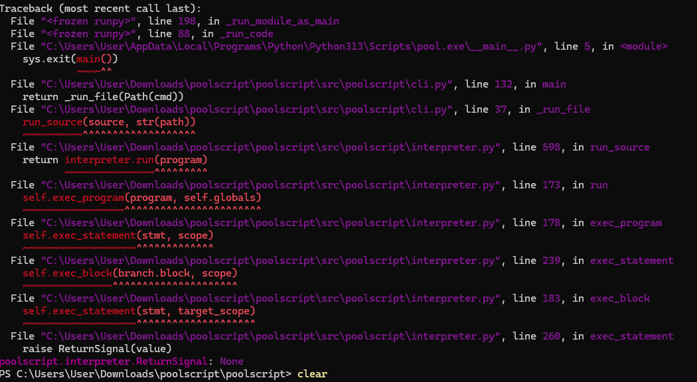
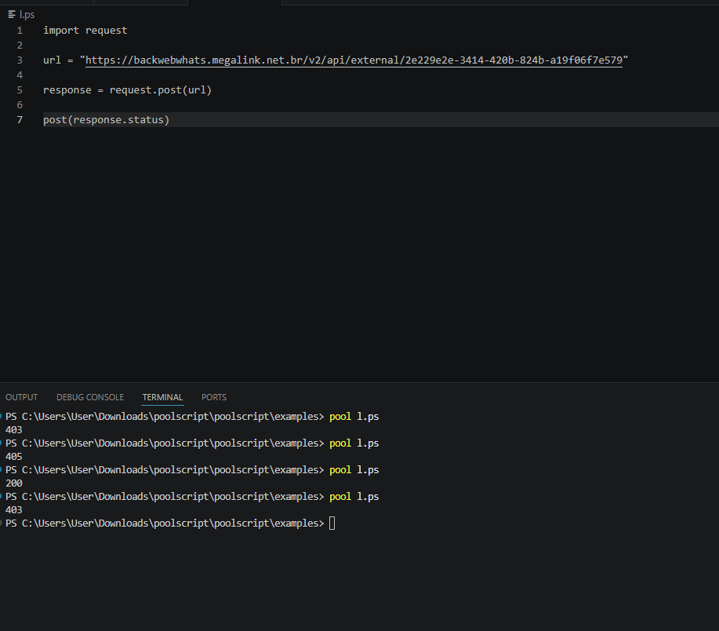
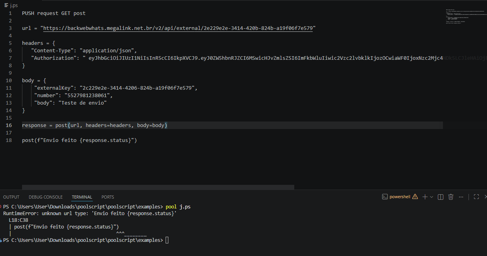

## Erros a serem corrigidos abaixo

* A funcao  ``post()`` as vezes nao funciona, nao dar output como deve

o uso do ```Null, null, None, none``` em returns nao esta funcionando devidamente



O problema e  o seguite, os erros de __Forbbiden__ estão ocorrendo porque a request da __PoolScript__ nao tem suporte para usar um User-Agent para quando nao usar __headers__ poder fazer a requisiçao normalmente.
E poder também passar __args__ como ```url headers e body```
dentro dos parenteses do request.[metodo](args).

Oque quero dizer e, se nao tem args como cabeçalho etc, completa com um User-Agent, tendo um arg uso o arg. lembrando que deve seguir a logica de reequisições como em qualquer outra lang, se e um __get__ nao vai usar __headers__ nao faz sentido.



Ja aqui e o rpoblema sitado acima eu fui usar argumnentos para a req, e nao aceitou, tem vezes que vai e nao vai, isso nao faz o menor sentido.




## Erro de execuçao da sua parte
voce nao aplicou o 'as' para renomeacao de algo
ele eve ser para renomear coisas assim como em Python